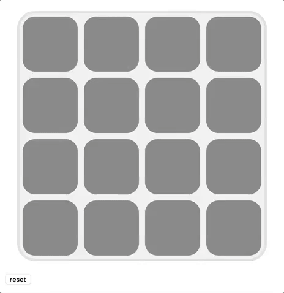

# Concentration Game Tutorial

# concentration game is a card  game also known as <b>Match Match</b> ,<b>Pelmanism</b>,<b>Pexeso</b>,<b>Pairs</b>.

### You can read more about it in this  [wikipedia  concentration game](https://en.wikipedia.org/wiki/Concentration_(card_game)).

This is how the game looks.
Concentration game.

# Inspiration

This game was inspired by [make School game](https://www.makeschool.com/academy/track/standalone/javascript-concentration-game/JavaScript-game-Tutorial) tutorial.

